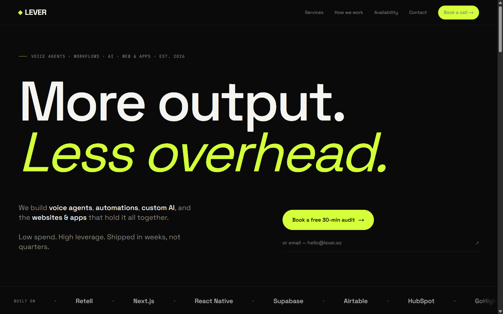

# LEVER — Automation Agency Marketing Site

A dark, type-led single-page marketing site for an automation/AI agency, with a fully
database-backed booking calendar. Built with Next.js App Router and deployed on Vercel.

**Live:** https://leverso.vercel.app



## Features

- **Rotating hero headline** — 4 variants on a 4s cycle with a fade-up/blur-in animation,
  gated behind `prefers-reduced-motion` so the headline is always visible without animation
- **Auto-scrolling stack marquee** with seamless loop and edge fade
- **Services accordion** — six expandable rows, single-open, animated accent rule sweep
- **Booking calendar backed by a real database** — month grid with live availability
  (available / fully booked / off / past states), driven entirely by server data
- **Timezone-aware slots** — business hours are stored in the business timezone (UTC+8);
  the visitor's timezone is auto-detected and all slot times convert live via a picker
- **Double-booking protection** — a partial unique index on `(date, slot_time)` for
  non-cancelled bookings makes slot collisions impossible at the database level; the API
  returns `409` and the UI refetches gracefully
- **Booking flow** — inline form → `POST /api/bookings` → success state, no mailto hacks
- Fluid `clamp()` type scale, custom-property design tokens, keyboard-focusable calendar

## Stack

| Layer | Tech |
|---|---|
| Framework | Next.js (App Router) + React + TypeScript |
| Styling | Tailwind CSS + CSS custom-property design tokens |
| Fonts | Space Grotesk + JetBrains Mono via `next/font` (self-hosted) |
| Database | Neon serverless Postgres |
| ORM | Drizzle ORM + drizzle-kit |
| Validation | Zod |
| Hosting | Vercel |

## API

- `GET /api/availability?month=YYYY-MM` — computed status + free slots per day, from
  `availability_rules` (recurring weekday/slot rules), `blocked_dates`, and `bookings`
- `POST /api/bookings` — validates the slot is still offerable/free, inserts a pending
  booking with the visitor's timezone; unique-constraint race → `409`

## Local development

```bash
npm install
# create .env.local with your Postgres connection string:
# DATABASE_URL=postgres://...
npm run db:push   # create tables
npm run db:seed   # seed working hours (Mon–Fri, 6 slots/day)
npm run dev
```

| Script | What it does |
|---|---|
| `npm run dev` | dev server at localhost:3000 |
| `npm run build` | production build |
| `npm run db:push` | sync Drizzle schema to the database |
| `npm run db:seed` | seed default availability rules |
| `npm run db:studio` | browse the database (Drizzle Studio) |

## Project structure

```
app/            pages, layout (metadata/OG), API route handlers
components/     Nav, Hero, StackStrip, Services, Process, BookingCalendar, ...
lib/site.ts     brand config (name, domain, email) — single place to rebrand
lib/data.ts     site content (services, process, headlines)
lib/*.ts        availability computation + timezone helpers
db/             Drizzle schema, client, seed
```
